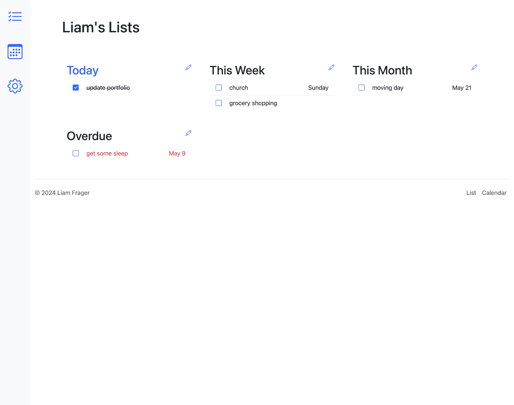
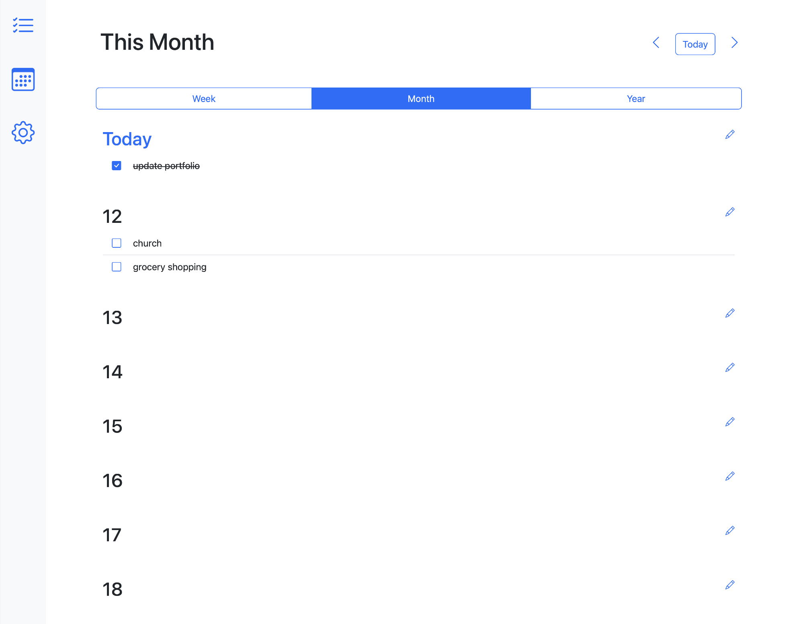
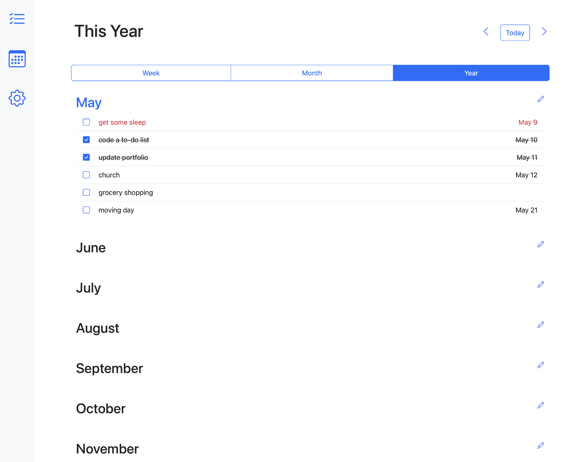
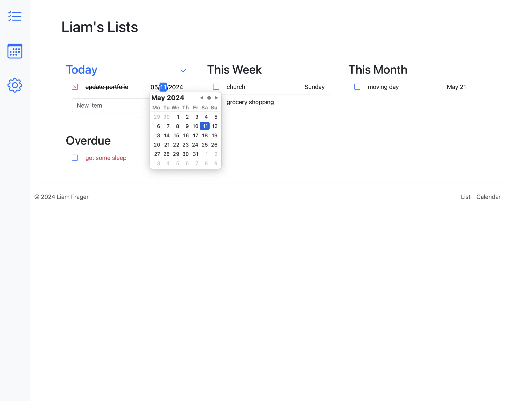
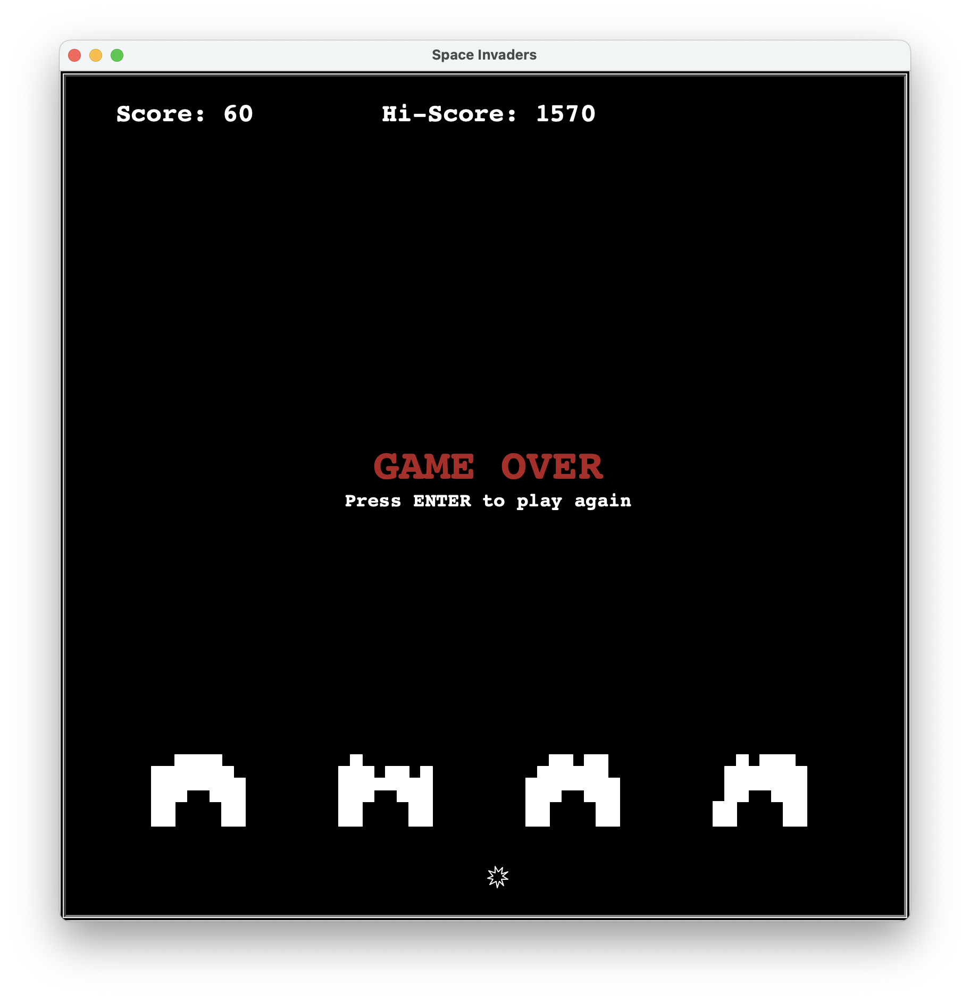

# Liam Frager Software Portfolio

## Projects

- [To-Do List](#to-do-list)
- [Space Invaders](#space-invaders)
- [Bookshelf](#bookshelf)

## To-Do List

### Mobile compatible

---

## Space Invaders
A desktop remake of the original space invaders game written in python.

### Starting screen
Uses ASCII art for a dramatic title screen.

### Mystery UFO?!
What will happen when you shoot the ufo? (You get bonus points).

### Death
The player explodes and loses a life when hit by an alien's laser.

### Game Over
When you lose all your lives, the game is over. The high score is updated.

---

## Bookshelf
A web app that allows users to store their favorite books, take notes, and give a rating.

### View all your books
A grid display of all the books on the user's bookshelf.

### Sort books
The filter button allows the user to sort their bookshelf by title, author, rating, time added, or ISBN.

### Book details
The user can view a book's details, take notes, give it a rating out of five star. This is also where the user can remove a book from their shelf.

### Search for a book by ISBN number
The user can add a book by searching with an ISBN number.

### Mobile compatible
The web app is responsive and can be used on both desktop and mobile.

