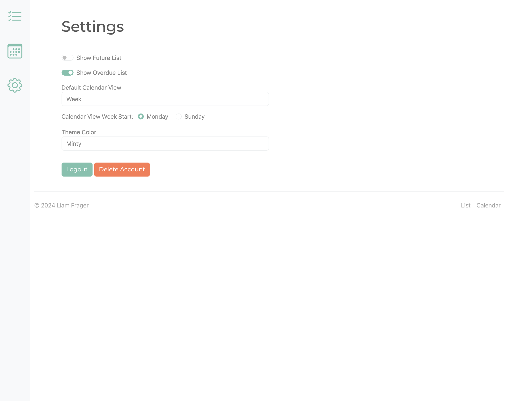
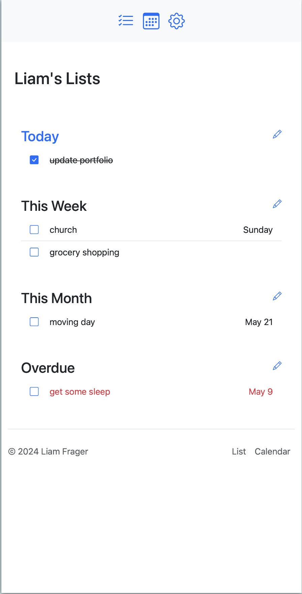
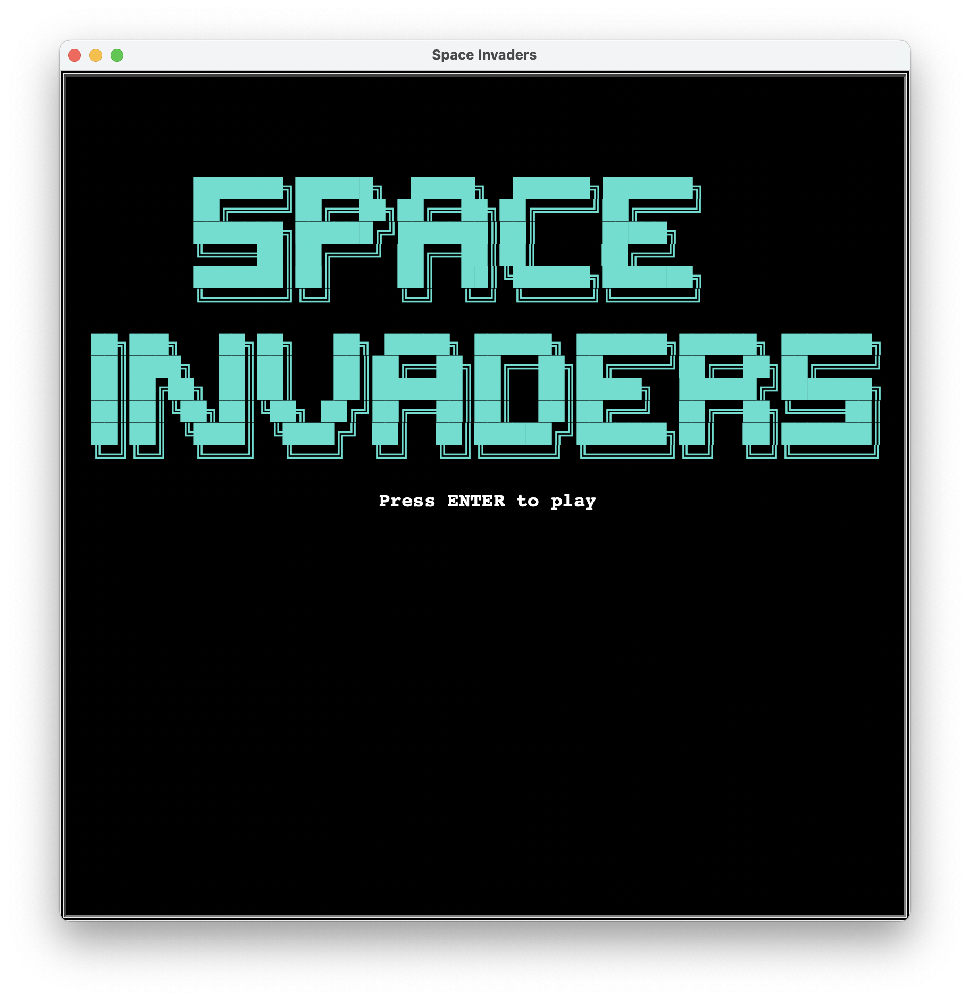

# Liam Frager Software Portfolio

## Projects

- [To-Do List](#to-do-list)
- [Space Invaders](#space-invaders)
- [Bookshelf](#bookshelf)
- [AVL Tree](#avl-tree)

---

## To-Do List
A To-do list web app with user authentication, multiple lists, and a calendar view.

### Login page
Implements secure user authentication with password hashing.

### List view
Show lists for "Today", "This Week", and "This Month". Also features optional "Overdue" and "Future" lists.

### Calendar view
Scroll forward and backward in a calendar of your to-do items. Viewing options include...

By week:

By month:

By year:

### Edit
Users can edit a list to add more items, change dates, and delete items.

### Settings
Comes with a settings page with the following features:
- toggle optional lists in list view
- change the default calendar view
- choose whether the week starts on Monday or Sunday
- apply a theme color to the whole application
- logout
- delete account

### Mobile compatible
The web app is responsive and can be used on both desktop and mobile.

---

## Space Invaders
A desktop remake of the original space invaders game written in python.

### Starting screen
Uses ASCII art for a dramatic title screen.

### Mystery UFO?!
What will happen when you shoot the ufo? (You get bonus points).

### Death
The player explodes and loses a life when hit by an alien's laser.

### Game Over
When you lose all your lives, the game is over. The high score is updated.

---

## Bookshelf
A web app that allows users to store their favorite books, take notes, and give a rating.

### View all your books
A grid display of all the books on the user's bookshelf.

### Sort books
The filter button allows the user to sort their bookshelf by title, author, rating, time added, or ISBN.

### Book details
The user can view a book's details, take notes, give it a rating out of five star. This is also where the user can remove a book from their shelf.

### Search for a book by ISBN number
The user can add a book by searching with an ISBN number.

### Mobile compatible
The web app is responsive and can be used on both desktop and mobile.

---

## AVL Tree
An python implementation of an Adelson-Velsky-Landis binary search tree (AVL tree).

### Tree visualization
Includes a custom `__repr__` method that prints a visual representation of a node and up to three generations of its decendents.

### Functionality
Includes the following methods:
- `insert`: add a node to the tree.
- `delete`: remove a node from the tree.
- `exists`: returns a bool indicating whether a node with the given value exists in the tree.
- `find`: returns a node in the tree with the given value if there is one.

Includes the following properties:
- `max`: returns the node with the largest value.
- `min`: returns the node with the smallest value.
- `values`: returns all the values in the tree as a numerically sorted list.

### Known limitations
- `__repr__` method only works with values between 0 and 999 inclusive.
- Tree will not create a node with a value that is already in the tree (but one can insert a node whose child has a value that is already in the tree.)